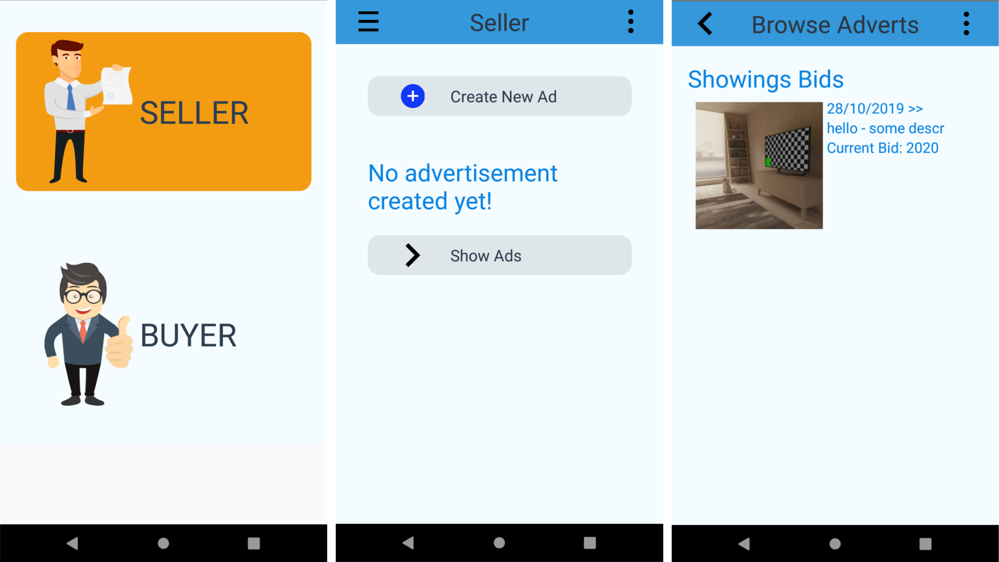

# Advertisement Management App
A React-Native application for Advertisement Marketplace. Sellers can create advertisements on the app and buyers can bid on the available advertisements.

## Requirements
- Node.js
- YARN
- React-Native Dev Environment ([Setup Guide](https://facebook.github.io/react-native/docs/getting-started))
- Android/iOS Dev Environment

Setting up react-native environment using react-native-cli is recommended.

## Running the app
- Clone the repo onto your local machine
- In the root directory, run `$ yarn install` to install all the dependencies
- Start your Android Virtual Device or iOS Simulator
- Start the metro bundler with `$ react-native start`
- Run `$ react-native run-android` or `$ react-native run-ios` to build the app onto your device
